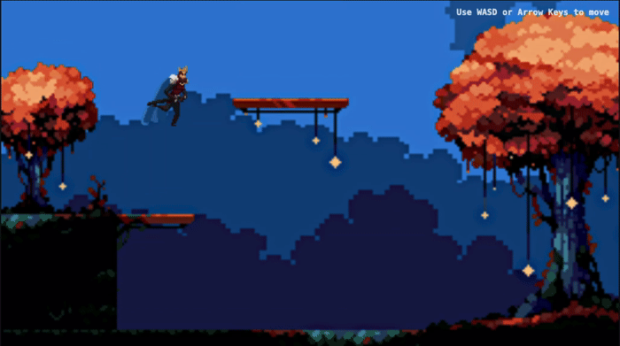

```text

██████╗ ██╗  ██╗███████╗███████╗██████╗  █████╗      ██╗
██╔══██╗██║  ██║██╔════╝██╔════╝██╔══██╗██╔══██╗     ██║
██║  ██║███████║█████╗  █████╗  ██████╔╝███████║     ██║
██║  ██║██╔══██║██╔══╝  ██╔══╝  ██╔══██╗██╔══██║██   ██║
██████╔╝██║  ██║███████╗███████╗██║  ██║██║  ██║╚█████╔╝
╚═════╝ ╚═╝  ╚═╝╚══════╝╚══════╝╚═╝  ╚═╝╚═╝  ╚═╝ ╚════╝

```

<!--

```bash
$ whoami
M S Dheeraj Murthy
$ cat role.txt
Systems Programmer / Backend Engineer / Open Source Enthusiast / Web Dev
$ uptime
since long long ago..
```
-->

<p align="center">
  <a href="https://dheeraj-murthy.github.io/HTML-Canvas-js-game/">
    
  </a>
</p>
<p align="center">
  <b>Click the preview to play.</b>
</p>

<!--
⸻

> about_me.md

name: M S Dheeraj Murthy location: India interests:

- Systems Programming
- Backend Engineering
- Self Hosting
- Networking
- Linux / Neovim / Tooling currently_building:

⸻

> tech_stack.sh

- Languages :: C++ / Rust / Go / Python / JavaScript
- Backend :: Node / Express / PostgreSQL / Redis
- DevOps :: Docker / Linux / Nginx / GitHub Actions
- Tools :: Neovim / tmux / Arch / Hyprland

⸻

> featured_project.exe

$ ./launch_game.sh Loading side quest... Injecting dopamine... Ready.

<p align="center">
  <a href="https://your-game-link.com">
    
  </a>
</p>
<p align="center">
  <b>Click the preview to play.</b>
</p>

<!--
⸻

> projects/

Project Description Project One Short description of cool thing you built
Project Two Another impressive side project Project Three Something low-level /
systems related


⸻

> stats –verbose

<p align="center">
  
  
</p>

⸻

> activity_graph

<p align="center">
  
</p>

⸻

<details>
<summary>⚠️ forbidden_knowledge.txt</summary>
sudo rm -rf / --no-preserve-root

don’t.

</details>

⸻

<div align="center">
> "Programs must be written for people to read,
> and only incidentally for machines to execute."
</div>

-->
